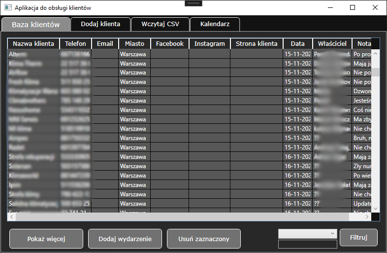

# ClientDatabaseApp

## 📋 Description

ClientDatabaseApp is a MVVM desktop application built using WPF technology on .NET Framework 4.7.2. It is developed using the MVVM pattern and Entity Framework 6 to interact with a PostgreSQL database. The application is designed to manage client information and events associated with these clients. It is an ideal solution for companies and organizations involved in customer service and project management.

## ✨ Features

The application can be used for:
- Maintaining up-to-date client information
- Planning and tracking events related to clients
- Importing multiple clients data from CSV files

## 🛠️ Technologies

- **.NET Framework 4.7.2**
- **WPF (Windows Presentation Foundation)**
- **Entity Framework 6**
- **PostgreSQL**
- **MVVM** (Model-View-ViewModel)
- **EventAggregator** (for handling event-based communication between components)
- **XUnit** (for unit testing)

## 📂 Application Tabs

The application is built with four main tabs.

### 1. Client Database 📊

This tab allows you to browse the list of clients using a `DataGrid`. Features include:
- **Show More**: Opens a view for editing the selected client's information.
- **Add Event**: Adds an event for the selected client on a chosen date.
- **Delete Selected**: Deletes the selected client.
- **Client Filtering**: Use the `ComboBox` to select the client's status and the `TextBox` to filter clients by name or city.




### 2. Add Client 📝

This tab allows you to add a new client:
- **Required**: Client Name
- **Optional**: Phone, Email, City, Facebook, Instagram, Client Website, Date, Owner Name, Status, Note


### 3. Import CSV 📥

This tab is for importing client data from a CSV file:
- **Select and Preview File**: Opens a dialog to select a CSV file and display it in a `DataGrid`.
- **Load Data**: Imports the data into the database, checking if the client already exists by name or email.


### 4. Calendar 📅

This tab contains a custom calendar:
- **Navigation**: Buttons to change the displayed month.
- **Event View**: Clicking on a day with an event displays a list of events on the right, with options to select and edit the event's notes using the **Select** button or delete the event using the **Delete** button.
- **Weather Information**: Fetched from three APIs:
  - **Ipify API**: Retrieves the user's current IP address.
  - **Geolocation API**: Retrieves latitude and longitude based on the IP address.
  - **OpenWeather API**: Retrieves current weather based on the geographical data.


## 🗂️ Database Model

The following diagram represents the database model used in the application:


## 🚀 Installation

1. **Clone the Repository**

   Clone the repository to your local machine by running the following command:
   ```bash
   git clone https://github.com/DamianSubzda/ClientDatabaseApp.git
   ```

3. **Install Necessary Packages**

   Navigate to the project directory and restore the required packages by running:
   ```bash
   dotnet restore
   ```
   
5. **Create the PostgreSQL Database**

   Create the PostgreSQL database using the database model mentioned earlier.
   
6. **Configure the Database Connection**

   Update the PostgreSQL database connection string in the appsettings.json file to point to your newly created database.

8. **Run the Application**

   Launch the WPF project in Visual Studio or use the following command:
    ```bash
    dotnet run
    ```

## ✅ Testing

The application has been tested using **77** unit tests. To run the tests:

- Open the solution in Visual Studio.
- Open the Test Explorer from the Test menu.
- Click Run All to execute all tests.

## 📄 License

The application is available under the MIT License. See the LICENSE file for details.
